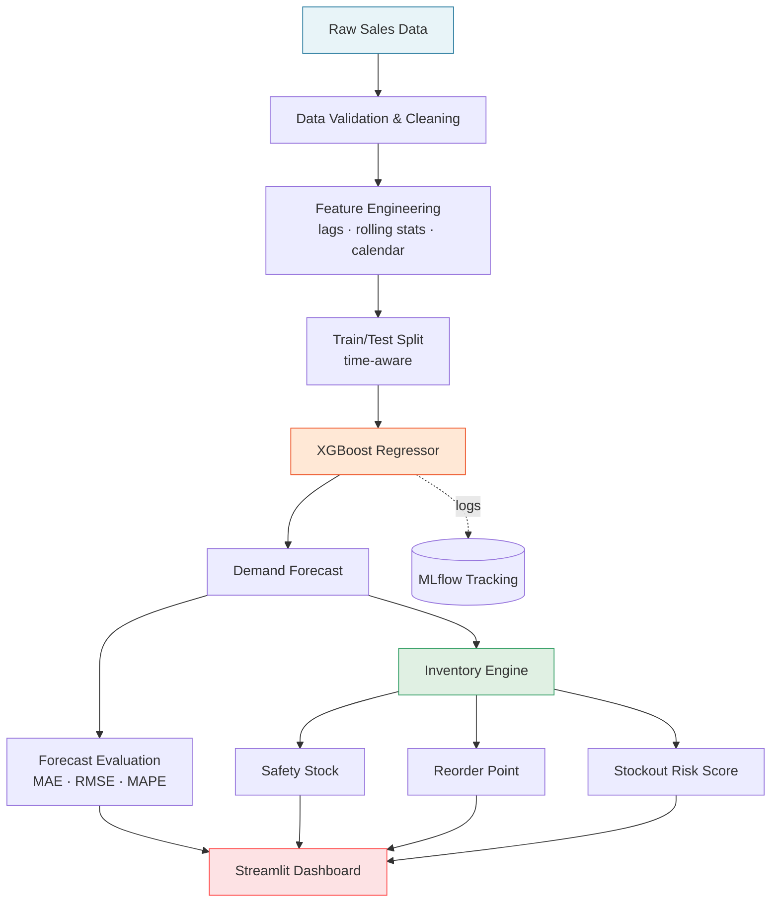
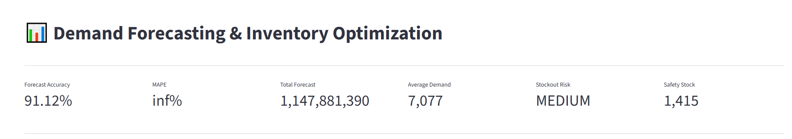
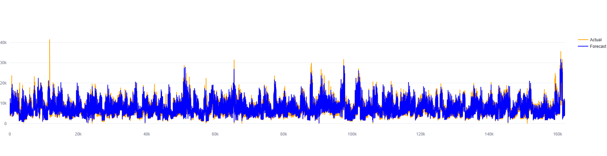
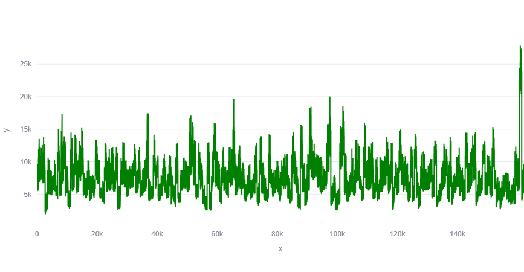
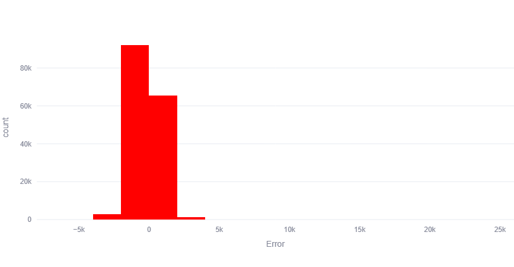
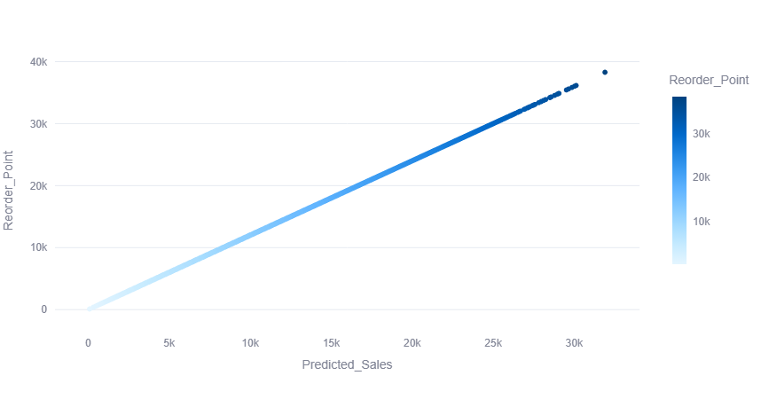
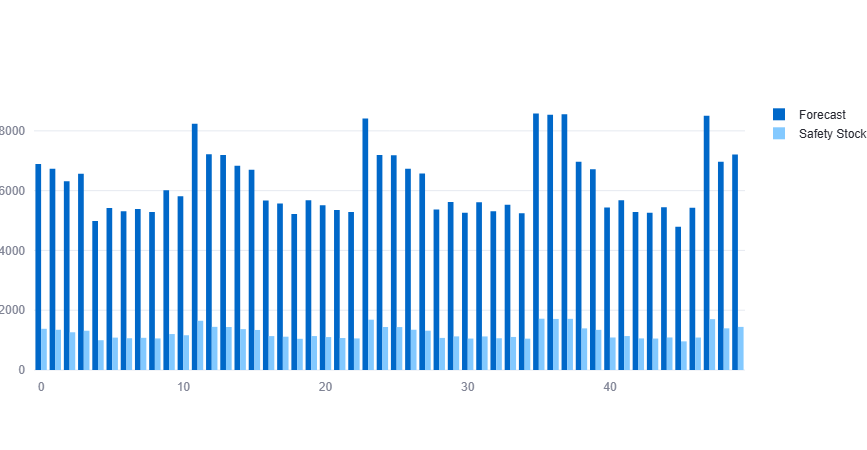

# 📦 Demand Forecasting & Inventory Optimization

> An end-to-end Machine Learning system that forecasts SKU-level demand and converts those forecasts into actionable inventory decisions — safety stock, reorder points, and stockout risk — served through an interactive Streamlit dashboard.

<p align="left">
  
  
  
  
  
</p>

---

## 📑 Table of Contents

- [Why This Project Exists](#-why-this-project-exists)
- [What It Does](#-what-it-does)
- [System Architecture](#-system-architecture)
- [Dashboard Preview](#-dashboard-preview)
- [The Inventory Math](#-the-inventory-math)
- [Feature Engineering](#-feature-engineering)
- [Modelling Approach](#-modelling-approach)
- [Results](#-results)
- [Tech Stack](#-tech-stack)
- [Project Structure](#-project-structure)
- [Getting Started](#-getting-started)
- [Design Decisions & Trade-offs](#-design-decisions--trade-offs)
- [Roadmap](#-roadmap)

---

## 🎯 Why This Project Exists

Inventory is where forecasting errors turn into real money. Carry too much and capital sits dead on a shelf; carry too little and you lose the sale **and** the customer.

Most "demand forecasting" projects stop at a prediction curve. This one doesn't — it closes the loop:

```
Historical Sales  ──►  Demand Forecast  ──►  Inventory Policy  ──►  Business Decision
                                              (SS, ROP, risk)        (when & how much
                                                                       to reorder)
```

A forecast is only useful if someone can act on it. The output of this system is a **reorder decision**, not a chart.

---

## ⚙️ What It Does

| Capability | Description |
|---|---|
| **Demand Forecasting** | SKU-level future demand prediction from historical sales using gradient-boosted trees |
| **Safety Stock** | Service-level-driven buffer calculation accounting for demand and lead-time variability |
| **Reorder Point** | Trigger threshold that tells you *exactly* when to place the next order |
| **Error Analysis** | Residual distribution, bias detection, and accuracy metrics (MAE / RMSE / MAPE) |
| **Risk Profiling** | Flags SKUs with high stockout probability or excess-inventory exposure |
| **Experiment Tracking** | Every training run logged to MLflow — params, metrics, and artifacts |
| **Interactive Dashboard** | Streamlit app for exploring forecasts, inventory policy, and error diagnostics |

---

## 🏗 System Architecture



---

## 📊 Dashboard Preview

### Inventory Optimization Dashboard
The main control panel — forecast, current stock position, and recommended action per SKU.



### Actual vs Predicted Demand
Sanity-check for the model. Tight tracking here is what earns trust in the downstream inventory numbers.



### Demand Trend Analysis
Level, trend, and seasonality decomposition to understand *why* demand moves.



### Forecast Error Distribution
Errors should be centred near zero and roughly symmetric. A skewed distribution means systematic over- or under-forecasting — which directly biases safety stock.



### Reorder Point Analysis
Where the reorder trigger sits relative to projected demand during lead time.



### Safety Stock vs Forecast
The buffer sizing versus forecast volatility — the core cost-vs-service trade-off, made visible.



---

## 🧮 The Inventory Math

The forecast feeds directly into classical inventory theory.

**Safety Stock** (demand and lead-time variability combined):

```
SS = Z × √( LT × σ_d²  +  d̄² × σ_LT² )
```

**Reorder Point:**

```
ROP = (d̄ × LT) + SS
```

| Symbol | Meaning |
|---|---|
| `Z` | Service-level z-score (e.g. 1.65 → 95%, 2.33 → 99%) |
| `d̄` | Average forecasted demand per period |
| `σ_d` | Standard deviation of demand (derived from forecast residuals) |
| `LT` | Lead time |
| `σ_LT` | Standard deviation of lead time |

**Key insight:** `σ_d` is estimated from *forecast residuals*, not raw historical demand. A better model shrinks residuals → shrinks safety stock → frees up working capital at the same service level. That is the direct financial link between model quality and business value.

---

## 🔧 Feature Engineering

Time-series problems live or die on features. The pipeline builds:

- **Lag features** — demand at `t-1`, `t-7`, `t-14`, `t-28` to capture short-term momentum and weekly cycles
- **Rolling aggregates** — moving mean, std, min, max over multiple windows for level and volatility signal
- **Calendar features** — day of week, month, quarter, week-of-year, month-start/end flags
- **Trend features** — expanding statistics and time index to let the model learn drift
- **Cyclical encoding** — sine/cosine transforms so the model understands that December is adjacent to January

> ⚠️ All lag and rolling features are computed strictly on **past** observations to prevent target leakage. Splits are time-ordered, never shuffled.

---

## 🤖 Modelling Approach

**Why XGBoost over classical time-series models?**

| Consideration | Reasoning |
|---|---|
| Multiple SKUs | A single global model learns cross-SKU patterns; ARIMA needs one model per series |
| Exogenous signals | Trees absorb calendar, promo, and categorical features natively |
| Non-linearity | Captures threshold and interaction effects that linear models miss |
| Speed | Retrains in seconds, making frequent refresh practical |
| Robustness | Handles outliers and missing values without heavy preprocessing |

Training is time-aware — validation always sits *after* training data in time, mirroring how the model would actually be used in production.

**Evaluation metrics:**
- **MAE** — average error in units (interpretable for planners)
- **RMSE** — penalises large misses, which is where stockouts come from
- **MAPE** — scale-free comparison across SKUs of different volume

---

## 📈 Results

The dashboard reports live metrics on the held-out period. Model performance is evaluated on three axes:

1. **Point accuracy** — how close the forecast is to actual demand
2. **Bias** — whether errors systematically lean high or low (critical, since bias propagates into inventory policy)
3. **Business impact** — projected stockout reduction and inventory-holding change versus a naive baseline

Every run is logged to MLflow, so model versions are comparable rather than anecdotal:

```bash
mlflow ui
```

---

## 🛠 Tech Stack

| Layer | Tools |
|---|---|
| **Language** | Python 3.9+ |
| **Data** | Pandas, NumPy |
| **Modelling** | Scikit-Learn, XGBoost |
| **Visualization** | Matplotlib, Seaborn, Plotly |
| **App Layer** | Streamlit |
| **Tracking** | MLflow |

---

## 📁 Project Structure

```text
Demand-Forecasting-Inventory-Optimization/
│
├── src/                  # Core pipeline — ingestion, features, training, inventory engine
├── notebooks/            # EDA and experimentation
├── models/               # Serialized trained models
├── dashboards/
│   └── app.py            # Streamlit application entry point
├── reports/              # Generated analysis outputs
├── screenshot/           # Dashboard captures
├── run_project.py        # One-command end-to-end pipeline runner
├── requirements.txt
└── README.md
```

---

## 🚀 Getting Started

### 1. Clone and set up the environment

```bash
git clone <your-repo-url>
cd Demand-Forecasting-Inventory-Optimization

python -m venv venv
source venv/bin/activate        # Windows: venv\Scripts\activate

pip install -r requirements.txt
```

### 2. Run the full pipeline

Executes ingestion → preprocessing → feature engineering → training → forecasting → inventory calculation.

```bash
python run_project.py
```

### 3. Launch the dashboard

```bash
streamlit run dashboards/app.py
```

Then open `http://localhost:8501`.

### 4. (Optional) Inspect experiments

```bash
mlflow ui
```

---

## 🧠 Design Decisions & Trade-offs

**Global model instead of per-SKU models.**
One model across all SKUs shares statistical strength — low-volume products borrow patterns from high-volume ones. The trade-off is reduced per-SKU specialisation, which is acceptable when SKUs share seasonality drivers.

**Residual-based variability instead of historical variability.**
Standard safety stock formulas use historical demand `σ`. Using forecast residuals instead means the buffer reflects *what the model doesn't know*, not *how much demand naturally moves*. This is the more correct formulation and it rewards better modelling with lower inventory.

**Time-ordered validation, never random splits.**
Random k-fold on time-series data leaks the future into the past and produces flattering, meaningless scores.

**Streamlit over a heavier web stack.**
The audience is supply-chain analysts, not engineers. Fast iteration and zero frontend overhead matter more than scalability at this stage.

---

## 🗺 Roadmap

- [ ] Probabilistic forecasting (quantile regression) for true service-level guarantees
- [ ] Multi-echelon inventory optimization across warehouses
- [ ] Automated replenishment recommendations with PO generation
- [ ] Deep learning baselines (LSTM, Temporal Fusion Transformer) benchmarked against XGBoost
- [ ] Drift detection with automated retraining triggers
- [ ] Containerization and cloud deployment
- [ ] Promotion and pricing features as demand drivers

---

<p align="center">
  <em>Built to turn forecasts into decisions.</em>
</p>